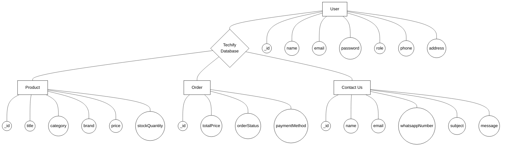

# Techify ER Diagram

```mermaid
graph TD
    %% Central Database Node (Diamond shape like in the image)
    DB{Techify<br/>Database}

    %% Entities
    User[User]
    Product[Product]
    Order[Order]
    Message[Contact Us]

    %% Connect Entities to the Central Node
    User --- DB
    DB --- Product
    DB --- Order
    DB --- Message

    %% User Attributes (Circles)
    U_id((_id))
    U_name((name))
    U_email((email))
    U_password((password))
    U_role((role))
    U_phone((phone))
    U_address((address))

    User --- U_id
    User --- U_name
    User --- U_email
    User --- U_password
    User --- U_role
    User --- U_phone
    User --- U_address

    %% Product Attributes (Circles)
    P_id((_id))
    P_title((title))
    P_category((category))
    P_brand((brand))
    P_price((price))
    P_stock((stockQuantity))

    Product --- P_id
    Product --- P_title
    Product --- P_category
    Product --- P_brand
    Product --- P_price
    Product --- P_stock

    %% Order Attributes (Circles)
    O_id((_id))
    O_totalPrice((totalPrice))
    O_status((orderStatus))
    O_payment((paymentMethod))

    Order --- O_id
    Order --- O_totalPrice
    Order --- O_status
    Order --- O_payment

    %% Message Attributes (Circles)
    M_id((_id))
    M_name((name))
    M_email((email))
    M_phone((whatsappNumber))
    M_subject((subject))
    M_message((message))

    Message --- M_id
    Message --- M_name
    Message --- M_email
    Message --- M_phone
    Message --- M_subject
    Message --- M_message

    %% Styling to mimic the image
    classDef default fill:#fff,stroke:#000,stroke-width:1px,color:#000;
    classDef entity fill:#fff,stroke:#000,stroke-width:1px,color:#000,shape:rect;
    classDef relationship fill:#fff,stroke:#000,stroke-width:1px,color:#000,shape:diamond;
    
    class User,Product,Order,Message entity;
    class DB relationship;
```
